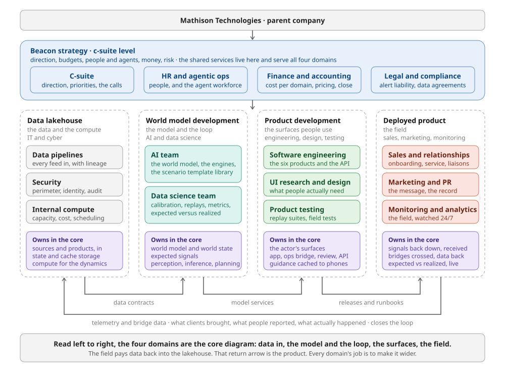

# Beacon domains and teams

**Set 2026-09-14.** The top-down modularization of Beacon so it can be built, tested, and deployed by teams that each manage a domain. It derives from [the core](hazard-world-model.md): each domain owns a piece of the hazard world model, and each handoff between domains is a contract with a test.

## The shape

- **Mathison Technologies** is the parent company. Beacon is a child.
- **Beacon strategy** holds the c-suite responsibilities and the shared services: HR and agentic ops, finance and accounting, legal and compliance. They serve all four domains.
- **Four domains**, in the order the data flows: data lakehouse, backend development, product development, deployed product.
- **Three handoffs forward**, one return. The return is the loop from the core drawn as an org chart.

## Read it as the core

| Domain | Boxes in the core it owns | The question it answers |
|---|---|---|
| Data lakehouse | Sources and products, in. Storage for the world state and the expected-signals cache. Compute for the dynamics. | Is every feed arriving, trusted, and affordable? |
| Backend development | Hazard dynamics, observation model, world priors. World state. Expected signals. Perception, inference, planning. | Is the picture right, and does it know when it is wrong? |
| Product development | The actor's surfaces: public and family app, operations bridge, hardening tools, after-action review, API. Guidance packs cached to phones. | Can a person act on the picture in the time they have? |
| Deployed product | Signals back down, actually received. Bridges crossed and data paid back. Expected versus realized, observed in the field. | Did the signal land, and what came back? |

The strategy level does not own a box. It owns the budget, the people and agents, the money, and the risk that every box carries.

## Strategy, c-suite level

**C-suite.** Direction and priorities: which hazard, which basin, which client first. The calls that cross domains: a warning-threshold policy, a partner agency, a price. Agents run the weekly rollup from every domain. Humans own every call.

**HR and agentic ops.** People and the agent workforce, managed as one workforce with two kinds of worker. Hiring, roles, and reviews for people. Provisioning, permissions, evaluation, and cost per agent for agents. Writes the "agents run, humans own" boundary for every team and audits that it holds. Agents run onboarding, fleet monitoring, agent evals. Humans own hiring, the boundary itself, and any change to what an agent may do.

**Finance and accounting.** Cost per domain, per run, per client. Compute is the biggest line and lives in the lakehouse, so the lakehouse reports it and finance attributes it. Pricing for the premium and municipal products. Agents run bookkeeping, attribution, forecasts. Humans own pricing, the close, and each domain's budget.

**Legal and compliance.** Alert liability: what Beacon may say to the public and to agencies, and in whose name. Data-sharing agreements with agencies and clients. Privacy for location, photos, and household data. Records that survive an inquiry. Agents run drafting, regulatory tracking, audit trails. Humans own every agreement and every rule about what a warning may say.

## Domain 1: Data lakehouse

The data and the compute. Home of IT and cyber. Owns everything before the model touches it and everything the model runs on.

- **Data pipelines.** Every feed in: satellites, gauges, seismometers, weather, phones, and the data each product brings back. Schemas, freshness, lineage, replay. A feed is not done until it can be replayed at its original timestamps. Agents run ingestion, schema-drift detection, backfills, freshness checks. Humans own onboarding a new source and the contract with its provider.
- **Security.** Perimeter, identity, secrets, audit. Beacon holds where people are and what their homes are made of, and sends messages people act on; both must be unforgeable. Agents run monitoring, patching, access reviews, audit logs. Humans own policy and incident command.
- **Internal compute.** Capacity, cost, and scheduling for dynamics runs, cache renders, replays. Reports cost per run to finance. Agents run scheduling, autoscaling, forecasts. Humans own capacity planning and vendors.

**Proof of done:** a data contract per feed that the backend's tests import, and a replay of a real event that reproduces the feeds minute by minute inside a stated compute budget.

## Domain 2: Backend development

The model and the loop. Home of AI and data science. Owns the core diagram itself and delivers it as versioned services with a scorecard.

- **AI team.** Hazard dynamics, the observation model, the world priors. The scenario template library (the three model libraries by world layer), the only place inference may draw hypotheses from. The three engines. Agents run experiments, surrogate training, regression evals, cache renders. Humans own model design, what enters the template library, and the thresholds at which planning may issue a warning.
- **Data science team.** Calibration: expected versus realized, the fourth consumer of the cache, turned into a number per model per event. Replays as the standing benchmark. The metrics every domain reports against. Agents run the analysis, replays, scorecards. Humans own what the metrics mean and the validation studies behind them.

**Proof of done:** world-state, expected-signals, and plan services behind versioned interfaces, and a scorecard on the replays that says how far ahead the picture was right and where it was wrong.

## Domain 3: Product development

The surfaces people use. Home of software engineering, UI research and design, and product testing. Owns the actor's surfaces: the six product uses and the API.

- **Software engineering.** Public and family app, emergency operations bridge, household and municipal hardening, after-action review, research and API. Guidance packs cached to phones. Each product is a bridge, so each ships with its return path. Agents run most code and tests, builds, dependency upkeep. Humans own architecture, review, and the release decision.
- **UI research and design.** What officials and residents actually need at each minute of a hazard, learned from them. The four-track posters are the brief. Agents run session synthesis, prototypes, variants. Humans own the research with real people and the design decisions.
- **Product testing.** Replay suites: every product run against recorded events, checking the right person would have seen the right thing at the right minute. Field tests with partner agencies. Offline tests with towers down. Agents run the suites on every change. Humans own test design, exploratory testing, field tests.

**Proof of done:** a release whose replay suite passes, with a runbook the deployed domain can operate from, and a return path that is measured.

## Domain 4: Deployed product

The field. Home of sales and external relationships, marketing and PR, product monitoring and analytics. Owns the last box in the core and the first: signals back down, and the data that comes back.

- **Sales and external relationships.** Three jobs, one relationship at three moments. *Client onboarding:* bringing an agency, town, or household in, which means bringing its data in (parcels, inventories, dispatch, plans). *Customer service:* keeping them. *Real-time emergency technical support liaisons:* a person on the line with the operations center while the hazard runs, translating between the room and the system. Agents run onboarding data intake, tier-one service, liaison copilots. Humans own the relationship, the agreements, and the liaison seat during a hazard.
- **Marketing and PR.** The message, and the public record of when Beacon was right or wrong. Agents run production and distribution. Humans own what is said, especially after an event.
- **Product monitoring and analytics.** The field, watched around the clock: did the alert arrive, was it opened, did people move, what did they report back. Expected versus realized in production, handed to data science as the training signal. Agents run the watching and first escalation. Humans own what counts as an incident and who gets woken.

**Proof of done:** a client live on a release, a liaison runbook rehearsed on a replay, and telemetry flowing back into the lakehouse under a data contract.

## The handoffs

| From → to | What crosses | The contract | The test |
|---|---|---|---|
| Lakehouse → Backend | Feeds, storage, compute | A data contract per feed: schema, freshness, lineage, replayability. A compute budget per run type. | Backend tests import the contracts. A replay reproduces the feeds inside budget. |
| Backend → Product | World state, expected signals, plans | Versioned service interfaces with a scorecard attached to every version. | Product replay suites run against the pinned version. No version ships without its scorecard. |
| Product → Deployed | Releases, runbooks, guidance packs | A release with a passing replay suite, a runbook, and a defined return path. | Liaison rehearsal on the replay. Field test with a partner agency. |
| Deployed → Lakehouse | Telemetry and bridge data | What clients brought, what people reported, what actually happened, under the same data contracts as any feed. | The return data appears in the next replay and the next scorecard. |

The return arrow is the product. Every domain's job is to make it wider.

## Agents and humans

Agents run the repeatable. Humans own the calls where a life or a liability sits. HR and agentic ops writes the boundary per team and audits it. Seats that stay human:

- The threshold at which a warning goes out, and what it may say.
- The liaison on the line with an operations center during a hazard.
- Security incident command.
- Every data-sharing agreement, and every hire.
- The public account of what Beacon got right and wrong after an event.

## The shared fixture

One replay, four test suites. Lahaina 2023 and Nepal 2026 are the first fixtures. The lakehouse replays their feeds at the original timestamps. The backend scores its picture against what happened. Product runs every surface against the replay. Deployed rehearses the liaison runbook on it. Every domain tests against the same recorded morning.

## The first slice, by domain: the Nepal flood, one basin

- **Strategy.** Legal reviews what a warning to a school may say and in whose name. Finance sets the compute budget. Agentic ops provisions each team's agents with their boundary written.
- **Lakehouse.** The basin's feeds replayable at original timestamps: gauges, seismic, imagery, weather, phone photos. Data contracts for each. A compute budget the dynamics fit inside.
- **Backend.** Flood dynamics for the basin. An observation model for gauges and phone photos. A template library holding earthquake, landslide, outburst flood. An expected-signals cache for the basin. The four engines on the replay, scored.
- **Product.** The public app with the basin's guidance pack cached offline. The operations bridge showing passable roads and where units are needed. The review replay of that morning next to what each team actually saw.
- **Deployed.** One partner agency onboarded with its dispatch data. A liaison runbook rehearsed on the replay. Monitoring that reports whether the guidance would have arrived, and what came back.

## Published copy

https://claude.ai/code/artifact/fcca0b11-a0a6-4084-8575-6dfe5f4b1c05 (page source: `beacon-domains.html`)
