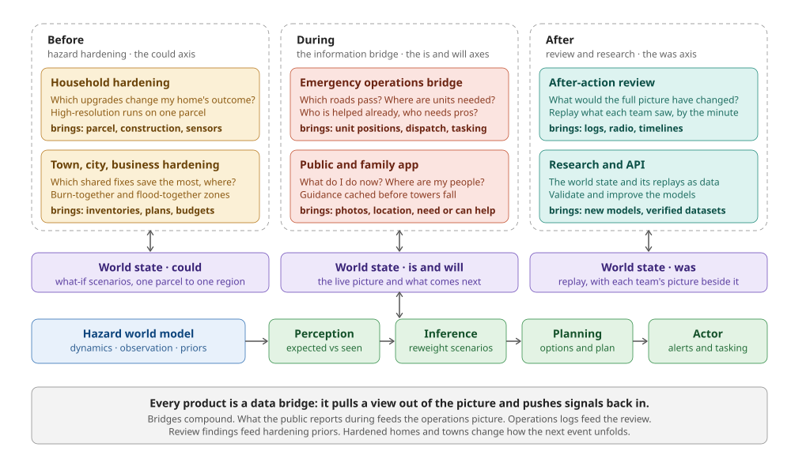
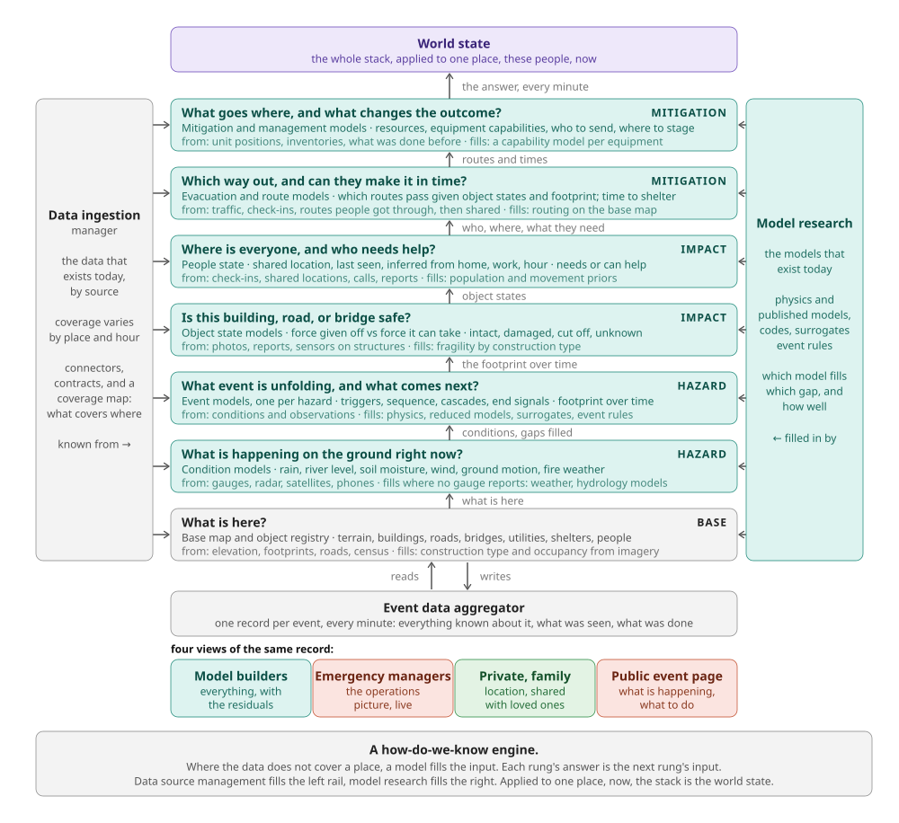
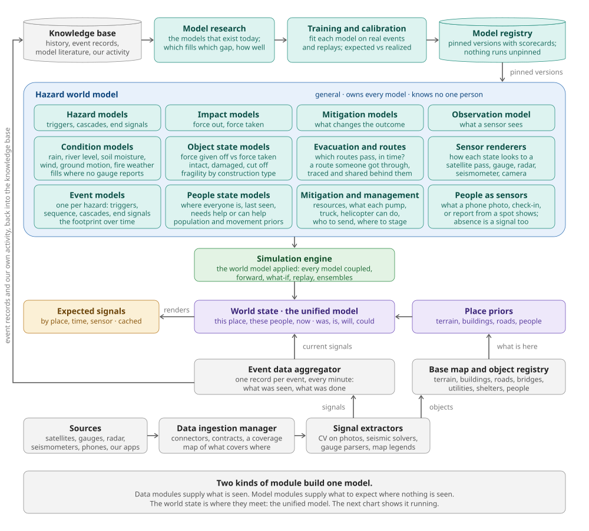
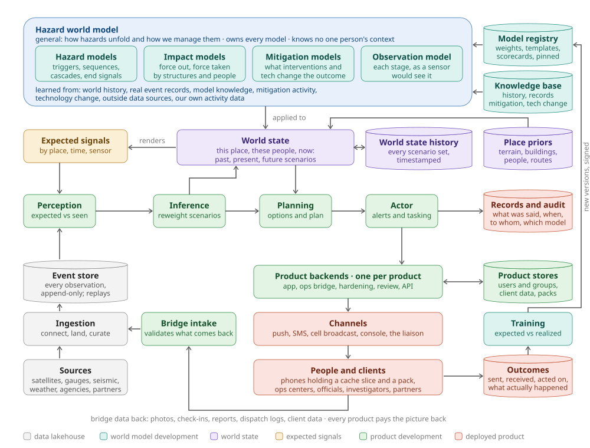

# Beacon as a hazard world model

**The core. Set 2026-09-12.** This is the reference framing for the Beacon engine. Everything else is a use of it.

## The statement

Beacon is a **hazard world model**: a general model of how things go down and how we handle them. It is a cause-and-effect engine trained on how we model geophysical events, their triggers, their event sequences and cascades, their end signals, and how the hazard itself unfolds; and, as a secondary layer, the impact: how much force the event gives off and, at the same time, how much force a structure can take, and whether a person can reach a shelter in time to call it one. It owns the mitigation models too, and everything that went into building all of them. It has no direct knowledge of any one person's context. That is what the **world state** is for: the current signals and one place's priors with the world model applied to them. Data from every source, and from Beacon's own products, is aggregated into the state. The state is used to figure out what to do, and signals are sent back down.

## The modules

**Hazard world model.** The general model, and the computational, modeling-heavy core. Four kinds of model, kept separate.

- **Hazard models.** Triggers, event sequences, cascades, end signals. How the hazard itself unfolds.
- **Impact models.** How much force the hazard gives off, and how much force structures, routes, and people can take. Whether a person can get there in time.
- **Mitigation models.** What interventions and technology change the outcome.
- **Observation model.** What each stage looks like to each sensor: a satellite pass, a gauge reading, a seismometer trace, a phone photo from a given spot.

**Learned from.** World history, real event records, model knowledge, mitigation activity, technology change, outside data sources, and our own activity data, sucked up into one system that understands what is possible with regard to hazards and how we manage them.

**World state.** The specific: this place, these people, now. Current signals and the place's priors (terrain, buildings, people, routes) with the world model applied. A weighted set of scenarios across three times: what happened, what is happening, what comes next. Not a single map. In Nepal, "earthquake" and "landslide" were both live hypotheses for four days; a single-answer state would have picked wrong.

**Expected signals.** Predicted observations, rendered from the world state by the observation model, indexed by place, time, and sensor. Held in a cache because four different modules consume the same object (see below).

**Perception engine.** New data is ingested and compared against the expected signal for that place, time, and sensor. "We expect a dry hill. The hill is wet." The residual is the output. Absence counts: three gauges expected to report and all silent is a large residual, which is exactly the Nepal failure nobody was watching for.

**Inference engine.** Triggered by surprise. Given what is being seen, reweight the scenarios for what happened, what is happening, and what is likely next. Spawn new hypotheses from a library of hazard scenario templates, never freely. Roll the dynamics forward to produce new future scenarios. Write the updated world state.

**Planning engine.** Over the scenario distribution, weigh warning, guidance, and mitigation options: lives saved, timing, false-alarm cost. Produce a plan.

**Actor.** Executes the plan: alerts, guidance, tasking. Sends signals back down to phones, agencies, and responders.

## Where the expected signals go

They are one object with four consumers. That is why they live in a cache rather than inside any single module.

1. **Perception** uses them as the comparator, including absence as a signal.
2. **Planning** uses them as a sensing plan. Whichever expected signal would most separate the live hypotheses is the one worth tasking: ask phones inside a geofence for a photo, request a drone pass. This is active perception, and it is the mechanism behind viewshed and geofence corroboration.
3. **The actor and products** use them as guidance content. "Water expected at Betrawati around 09:20" is an expected signal handed to a person. Pre-caching them to phones is what keeps guidance working when towers fall.
4. **Training** uses expected versus realized as the calibration signal for the world model itself.

## Mapping to the five-step loop

| Loop step (2026-09-02) | World-model module |
|---|---|
| Collect | Ingestion into perception |
| Interpret | Perception engine |
| Reconcile | Inference engine |
| Simulate | Hazard dynamics, run forward |
| Decide | Planning engine |
| Send back down | Actor |
| Unified Picture | World state |

Nothing from the earlier design is lost. The one-row engine poster survives with new labels.

## Two cautions for the build

- **Hypothesis explosion.** Inference must draw from a library of hazard scenario templates. The three model libraries by world layer (geophysical, structure and infrastructure, living things) are that library. Without it, one surprising photo spawns unbounded explanations.
- **Cost lives in the world model, not in perception.** Rendering expectations is what makes perception cheap enough to run at the edge, including on a phone with no signal. Design the cache so a phone can hold the expectations for its own area.

## The Nepal morning, run through it

The seismic solver's "earthquake" is a residual against the expected waveform for a shallow event, which spawns the landslide hypothesis. The gauges going silent together is a residual against expected readings, which confirms a flood front. A photo of brown water at Betrawati localizes the front. Dynamics roll it forward to the school at plus fifty minutes. Planning picks "walk uphill now." The actor sends it with the place and the time in it.

## How the product lines use it

Every product is a question asked of the world state, and a bridge that pays data back into it. The product is creating and reinforcing **data bridges**, then building the unified picture that makes those bridges worth crossing.

| Product use | Who | Phase, axis | Asks the world state | Brings back |
|---|---|---|---|---|
| Household hardening | premium households | before · could | High-resolution scenario runs on one parcel; which upgrades change the outcome | parcel, construction, photos, home sensors |
| Town, city, business hardening | officials, businesses | before · could | Burn-together and flood-together zones; which shared fixes save the most per dollar, where | inventories, plans, budgets, mitigations built |
| Emergency operations bridge | emergency services | during · is, will | Which roads pass; where units are and are needed; who is already helped by neighbors and who needs professionals | unit positions, dispatch, tasking, what each team saw each minute |
| Public and family app | the public | during · is, will | What do I do now, which way out, where are my people; guidance cached before towers fall | photos, location, need help or can help |
| After-action review | emergency investigators | after · was | Replay with the reconstructed state beside each team's actual picture; what would the full picture have changed | logs, radio, timelines, findings that become hardening priors |
| Research and API | scientists, partners | after · was | The world state and replays as data; validate models | new models, verified datasets |

The "who needs professionals" question in operations is answerable only because the public app feeds the living-things layer of the world state. The after-action review is the four-track record from the posters, generated rather than reconstructed months later.

**The bridges compound.** What the public reports during feeds the operations picture. Operations logs feed the review. Review findings feed hardening priors. Hardened homes and towns change how the next event unfolds.

## Inside: the how-do-we-know engine

How do we know where somebody is? Whether someone needs help? Whether a building or a location is safe? Whether it is going to rain, and what the river will do? The world model is the answer to all of those questions, and it is the heart of the product. It is a stack of models, one rung per question. The data that exists today fills what it can; where coverage runs out, a model fills the input; each rung's answer is the next rung's input. Applied to one place, now, the whole stack is the world state. The section after this one is the model in use.

Read it from the bottom up.

| Rung | The question | Known from | Filled in by |
|---|---|---|---|
| Base map and object registry | What is here? Terrain, buildings, roads, bridges, utilities, shelters, people | elevation, footprints, roads, census | construction type and occupancy from imagery |
| Condition models | What is happening right now? Rain, river level, soil moisture, wind, ground motion, fire weather | gauges, radar, satellites, phones | weather and hydrology models where no gauge reports |
| Event models, one per hazard | What event is unfolding, and what comes next? Triggers, sequence, cascades, end signals, the footprint over time | conditions and observations | physics, reduced models, surrogates, event rules |
| Object state models | Is this building, road, or bridge safe? Force given off vs force it can take; intact, damaged, cut off, unknown | photos, reports, sensors on structures | fragility by construction type |
| People state | Where is everyone, and who needs help? Shared location, last seen, inferred from home, work, hour; needs or can help | check-ins, shared locations, calls, reports | population and movement priors |
| Evacuation and route models | Which way out, and can they make it in time? Which routes pass; time to shelter; a route someone got through, traced and shared | traffic, check-ins, routes people got through | routing over the base map |
| Mitigation and management models | What goes where, and what changes the outcome? Resources, equipment capabilities, who to send, where to stage | unit positions, inventories, what was done before | a capability model per equipment type |

The two rails: a **data ingestion manager** on the left (the data that exists today, by source, with a coverage map of what covers where) and **model research** on the right (the models that exist today, and which one fills which gap, how well). Beneath the stack, the **event data aggregator** holds one record per event, every minute, with four views of the same record: model builders (everything, with residuals), emergency managers (the operations picture, live), private for a family (a person's location, shared with loved ones), and the public event page (what is happening, what to do).

The core's four boxes map onto the tags: condition and event models are the hazard models; object and people state are the impact models; evacuation and mitigation and management are the mitigation models; the observation model is the "known from" line of every rung. Building the model is fitting each rung on real events and replays, validating by replay, signing, and pinning in the registry. Training in the in-use diagram is that refit, running.

## Building: the modules that go into the unified model

The chart after this one shows the model in use. This one shows what it is made of. The shape is the core's: the general model on top, opened into the modules inside it; the world state beneath, labelled for what it is, the **unified model**; and, rising from the bottom, the data modules that feed it. Across the top is how the general model is made: a knowledge base, model research over it, training and calibration, and a registry that pins what passes. Two kinds of module build one model. Data modules supply what is seen. Model modules supply what to expect where nothing is seen. The world state is where they meet.

Read it top-down. The top row makes the general model. The container is what it holds. The simulation engine applies it. The bottom rows feed the state with what is seen. The path up the left edge is our own records going back into the knowledge base.

| Module | What it makes | Hands it to |
|---|---|---|
| Knowledge base | history, event records, model literature, mitigation activity, technology change, our own activity data | model research |
| Model research | which existing model fills which gap, and how well: physics, reduced models, surrogates, event rules | training |
| Training and calibration | each model fit on real events and replays; expected versus realized; scored and signed | model registry |
| Model registry | pinned versions with scorecards; nothing runs unpinned | the hazard world model; every engine at startup |
| Condition models | rain, river level, soil moisture, wind, ground motion, fire weather, filled where no gauge reports | event models |
| Event models, one per hazard | triggers, sequence, cascades, end signals; the footprint over time; the scenario template library inference draws from | object state, people state |
| Object state models | force given off against force taken; intact, damaged, cut off, unknown; fragility by construction type | evacuation and routes, mitigation |
| People state models | where everyone is, last seen; needs help or can help; population and movement priors | evacuation and routes, mitigation |
| Evacuation and routes | which routes pass and time to shelter; routes people got through, traced and shared behind them | mitigation and management, planning |
| Mitigation and management | resources, what each pump, truck, helicopter can do, who to send, where to stage | planning |
| Sensor renderers | how each state looks to a satellite pass, gauge, radar, seismometer, camera | expected signals |
| People as sensors | what a phone photo, check-in, or report from a spot would show; absence as a signal | expected signals, perception |
| Simulation engine | the world model applied: every model coupled over one place, forward, what-if, replay, ensembles | world state |
| World state, the unified model | this place, these people, now; weighted scenarios across was, is, will, could | expected signals, the engines, every product |
| Expected signals | predicted observations by place, time, sensor, cached; slices ship to phones | perception, planning, actor, training |
| Place priors | terrain, buildings, roads, people for one place, versioned | world state |
| Base map and object registry | what is here: terrain, buildings, roads, bridges, utilities, shelters, people; every object above it has a row here | place priors |
| Event data aggregator | one record per event, every minute: what was seen, what was done; four views of it | world state as current signals; knowledge base as records |
| Signal extractors | signals from raw data: computer vision on photos, seismic solvers, gauge parsers, map legends | event data aggregator; base map |
| Data ingestion manager | connectors, data contracts, a coverage map of what covers where | signal extractors |
| Sources | satellites, gauges, radar, seismometers, phones, our own apps | data ingestion manager |

The rungs of the how-do-we-know stack are the eight model modules inside the container, sorted into the core's four families. The stores from the in-use chart are the drums here. Nothing is added that the other charts do not already name; this one shows how the pieces fit together into the one object every product uses.

## In use: the same diagram, grown

The core sits at the center: the general world model on top, the specific world state beneath it. Around it: the stores, drawn as drums beside the module that writes them, and the two grey boxes from the core opened up into the product side. Sources come in at the bottom left and rise into perception. The actor's plan goes down the right into product backends, channels, and people. What people and clients send back crosses bridge intake and re-enters as a source. Colors are the domains that own each piece (see [the org chart](beacon-domains.md)).

**The four movements.**

1. **In.** Sources and our own products arrive through ingestion: connect, land raw and immutable, curate under a data contract. They become the event store. Perception reads from the event store, never from a feed directly, so a replay and a live run look identical to the engines.
2. **Through.** Perception writes residuals. Inference writes a new scenario set into world state history. The world state renders expected signals into the cache. Planning reads both and hands a plan to the actor, which writes what it said to records and audit. The engines start from a pinned version in the model registry.
3. **Out.** The actor hands alerts and tasking to the product backends, one per product. Each turns them into what its client needs: a push and a pack for a phone, a layer on the wall of an operations center, a job for a hardening run, a replay for a review. Channels carry them, including the liaison on the line. Phones hold a slice of the cache and a pack, so they keep working with no signal.
4. **Back.** Photos, check-ins, reports, dispatch logs, and client data cross bridge intake, are validated, and enter ingestion as a source like any other. Outcomes feed training, which compares expected with realized and writes new signed versions to the registry. The loop closes in the lakehouse and in the registry, not inside a product.

**The stores.**

| Store | Holds | Written by | Read by |
|---|---|---|---|
| Event store | Every observation as it arrived, append-only; named windows are the replay fixtures (Lahaina 2023, Nepal 2026) | Ingestion only | Perception, training, replay |
| Knowledge base | What the world model is learned from: history, event records, model literature, mitigation activity, technology change, outside sources, our own activity | World model team | Training |
| Place priors | Terrain, buildings, roads, population for a place, versioned; part of the world state, not the model | World model team; sharpened by hardening bridges | World state |
| World state history | Every scenario set inference wrote, timestamped; the past axis | Inference | Planning, review, training |
| Expected-signals cache | The hot store, by place, time, sensor; slices ship to phones | World state, via the observation model | Perception, planning, training, the public app |
| Model registry | Weights, surrogates, template library versions, scorecards; nothing runs unpinned | Training, with human sign-off | Every engine at startup |
| Product stores | Users and groups (accounts, households, parcels, families, agencies, permissions); client data (inventories, plans, dispatch); product state (subscriptions, jobs, packs); legal owns the rules | Product backends | Planning and actor (who is where, who to reach) |
| Outcomes | Sent, received, opened, acted on, what actually happened | Monitoring | Training |
| Records and audit | What was said, when, to whom, under which model version; immutable | Actor | An inquiry |

**What each domain runs, keeps, and publishes.** The starting point for breaking each domain into team responsibilities. Every box on the picture appears in exactly one row.

| Domain | Runs | Keeps (owns the schema) | Publishes |
|---|---|---|---|
| Data lakehouse | Sources connectors, ingestion, replay, compute, access. Operates every store. | Event store | Data contracts, compute budgets, access policy |
| World model development | The hazard world model, world state, cache rendering, perception, inference, planning, actor, training | Knowledge base, model registry, place priors, world state history, expected-signals cache | World state, expected signals, plan services, each version signed with its scorecard |
| Product development | Product backends, one per product; bridge intake; the API | Product stores | Releases, packs, runbooks, a return path per product |
| Deployed product | Channels, operations centers, liaisons and onboarding, monitoring | Outcomes, records and audit | Outcomes to training, client data to intake, the public record |

## Published copy

https://claude.ai/code/artifact/a5a21d1d-36e5-418d-8ad7-6f3a752c7089
