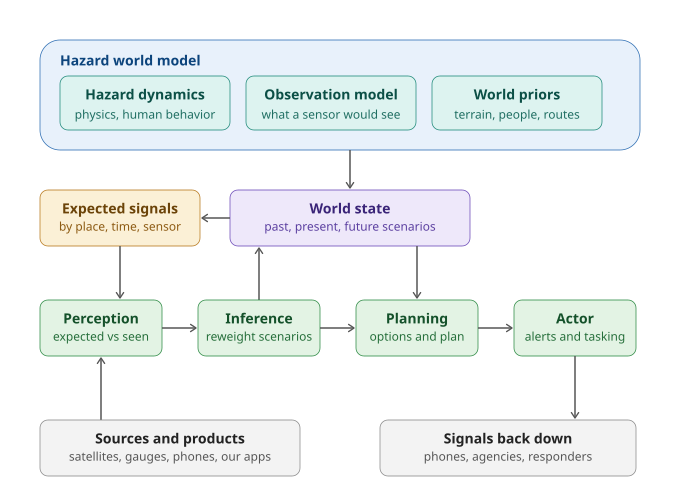

# Beacon as a hazard world model

**The core. Set 2026-09-12.** This is the reference framing for the Beacon engine. Everything else is a use of it.

## The statement

Beacon is a **hazard world model** that keeps an underlying view of how hazards unfold given physics and human behavior, and how any state of the world would look to each sensor: a satellite passing overhead, a river gauge, a seismometer, a person on the ground posting a picture. The world model maintains a **running world state**. Data from every source, and from Beacon's own products, is aggregated into it. The world state is used to figure out what to do, and signals are sent back down.

## The modules

**Hazard world model.** Three functions, kept separate.

- **Hazard dynamics.** Rolls a hazard state forward under physics and human behavior.
- **Observation model.** Renders any state into what each sensor would report: a satellite pass, a gauge reading, a seismometer trace, a phone photo from a given spot.
- **World priors.** Terrain, buildings, people, routes. The baseline the dynamics run over.

**World state.** A weighted set of scenarios across three times: what happened, what is happening, what comes next. Not a single map. In Nepal, "earthquake" and "landslide" were both live hypotheses for four days; a single-answer state would have picked wrong.

**Expected signals.** Predicted observations, rendered from the world state by the observation model, indexed by place, time, and sensor. Held in a cache because four different modules consume the same object (see below).

**Perception engine.** New data is ingested and compared against the expected signal for that place, time, and sensor. "We expect a dry hill. The hill is wet." The residual is the output. Absence counts: three gauges expected to report and all silent is a large residual, which is exactly the Nepal failure nobody was watching for.

**Inference engine.** Triggered by surprise. Given what is being seen, reweight the scenarios for what happened, what is happening, and what is likely next. Spawn new hypotheses from a library of hazard scenario templates, never freely. Roll the dynamics forward to produce new future scenarios. Write the updated world state.

**Planning engine.** Over the scenario distribution, weigh warning, guidance, and mitigation options: lives saved, timing, false-alarm cost. Produce a plan.

**Actor.** Executes the plan: alerts, guidance, tasking. Sends signals back down to phones, agencies, and responders.

## Where the expected signals go

They are one object with four consumers. That is why they live in a cache rather than inside any single module.

1. **Perception** uses them as the comparator, including absence as a signal.
2. **Planning** uses them as a sensing plan. Whichever expected signal would most separate the live hypotheses is the one worth tasking: ask phones inside a geofence for a photo, request a drone pass. This is active perception, and it is the mechanism behind viewshed and geofence corroboration.
3. **The actor and products** use them as guidance content. "Water expected at Betrawati around 09:20" is an expected signal handed to a person. Pre-caching them to phones is what keeps guidance working when towers fall.
4. **Training** uses expected versus realized as the calibration signal for the world model itself.

## Mapping to the five-step loop

| Loop step (2026-09-02) | World-model module |
|---|---|
| Collect | Ingestion into perception |
| Interpret | Perception engine |
| Reconcile | Inference engine |
| Simulate | Hazard dynamics, run forward |
| Decide | Planning engine |
| Send back down | Actor |
| Unified Picture | World state |

Nothing from the earlier design is lost. The one-row engine poster survives with new labels.

## Two cautions for the build

- **Hypothesis explosion.** Inference must draw from a library of hazard scenario templates. The three model libraries by world layer (geophysical, structure and infrastructure, living things) are that library. Without it, one surprising photo spawns unbounded explanations.
- **Cost lives in the world model, not in perception.** Rendering expectations is what makes perception cheap enough to run at the edge, including on a phone with no signal. Design the cache so a phone can hold the expectations for its own area.

## The Nepal morning, run through it

The seismic solver's "earthquake" is a residual against the expected waveform for a shallow event, which spawns the landslide hypothesis. The gauges going silent together is a residual against expected readings, which confirms a flood front. A photo of brown water at Betrawati localizes the front. Dynamics roll it forward to the school at plus fifty minutes. Planning picks "walk uphill now." The actor sends it with the place and the time in it.

## Published copy

https://claude.ai/code/artifact/a5a21d1d-36e5-418d-8ad7-6f3a752c7089
